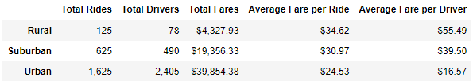
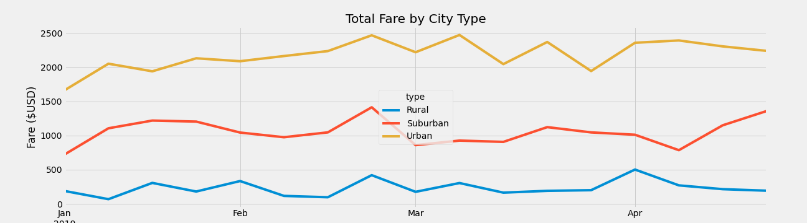

# PyBer_Analysis

## Purpose

The purpose of this data analysis was to compare ride-sharing data amongst Urban, Suburban, and Rural cities.
Specifically comparing weekly fares for each city type.

## Results

### Ratio of Rides to Drivers
- Urban cities have 1.48 times the number of drivers to rides

- Suburban cities have 1.27 times the number of rides to drivers

- Rural cities have 1.6 times the number of rides to drivers

### Average Fare per Ride
- Rural cities have the highest average fare per ride at $34.62

- Suburban cities have the second highest average fare per ride at $30.97

- Urban cities have the lowest average fare per ride at $24.53

### Average Fare per Driver
- Rural cities have the highest average fare per driver at $55.49

- Suburban cities have the second highest average fare per driver at $39.50

- Urban cities have the lowest average fare per driver at $16.57

### Total Fares
- Urban cities have the greatest total fares at $39,854.38

- Suburban cities have the second highest total fares at $19,356.33
  - 2.06 times lower than urban cities

- Rural cities have the lowest total fares at 4,327.93
  - 9.2 times lower than urban cities
  - 4.47 times lower than suburban cities

## Summary
- More drivers should be allocated to servicing rural areas.
  - This will lower cost of rides, and increase the number of rides.

- More drivers should be allocated to servicing rural areas.
  - This will lower cost of rides, and increase the number of rides.

- Drivers need to be limited in Urban areas
  - This will increase cost of rides, likely not affect number of rides severely

